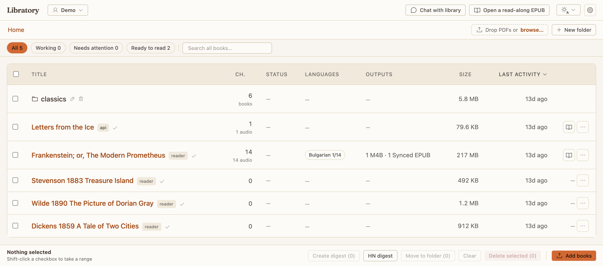
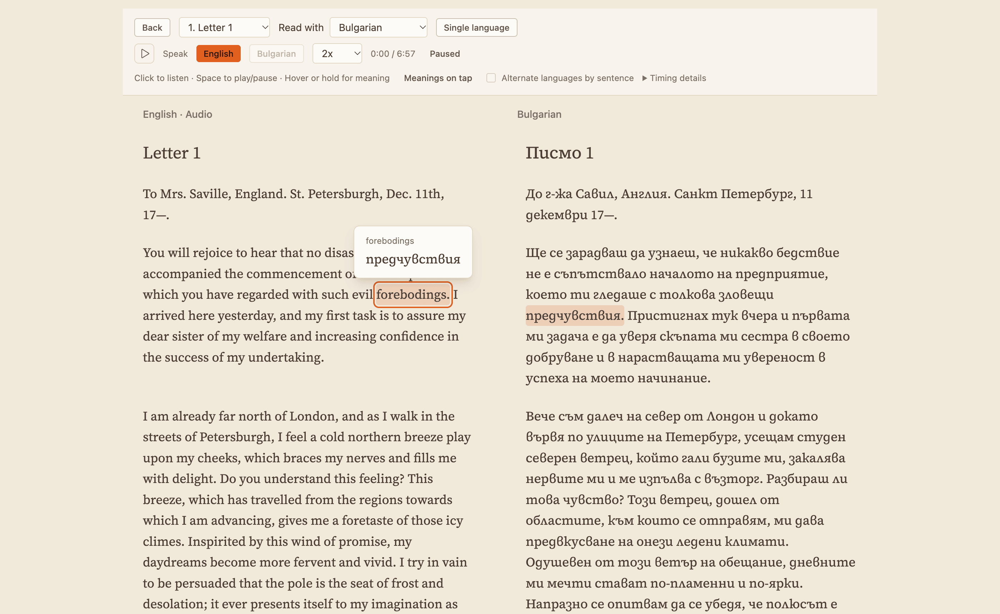
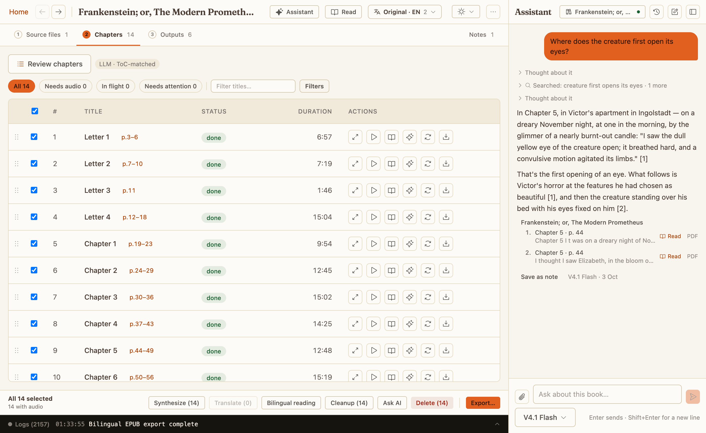
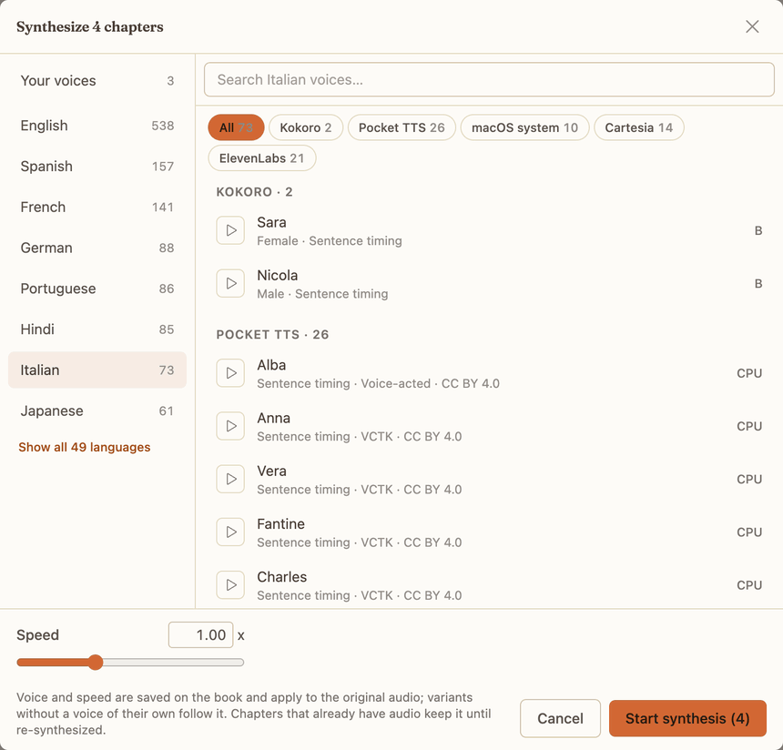
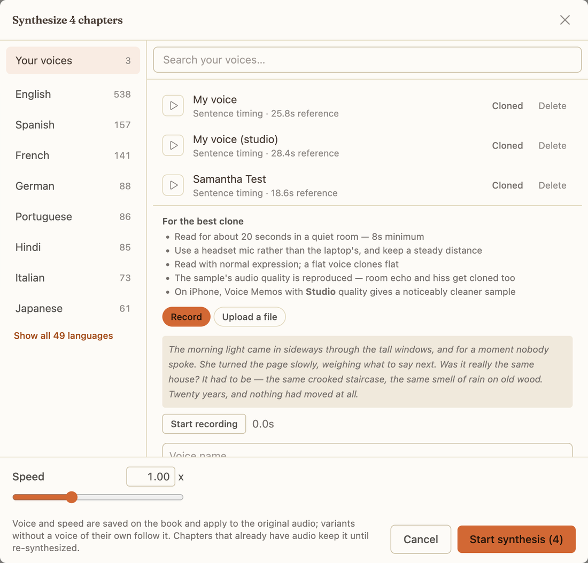

<h1 align="center">Libratory</h1>

<p align="center">
  <b>Your free book and audiobook laboratory.</b><br>
  Turn the PDFs you already own into chapter-marked audiobooks — on your own machine, offline-first.
</p>

<p align="center">
  
  
</p>

---


<p align="center"><i>Frankenstein, narrated by Kokoro — the spoken sentence lit on the book's own page, the spoken word marked inside it.</i></p>

The name is *library* plus *laboratory*, and that is what it is: a workbench for the PDFs you already own.

Take a book apart, clean up the OCR, translate or rewrite a chapter, pick a voice, and put it back together as an M4B audiobook — the format that carries real chapter markers, so players show the chapters — as a read-along book where the narration is highlighted on the page it was printed on, or as a bilingual edition that pairs each sentence with its translation.

It runs on your own machine: an Apple Silicon Mac, a Linux box (x86_64 or arm64, CPU is enough), or a single Docker container on a headless server.

**Offline-first, not offline-only.** Every narrator and every AI feature has a local option — the TTS engines run on your own GPU or CPU, and translation, rewrites, cleanup, digests and chat work against Ollama or LM Studio, auto-discovered with no configuration. The cloud is strictly opt-in: add an API key and you can use DeepSeek, OpenAI, Anthropic or Gemini for the AI features, or Cartesia and ElevenLabs for their voices. Add none and, once the models have been downloaded, none of your books or audio ever leaves the machine.

## What it does

- **PDF → audiobook** — it finds the chapters, narrates each one, and gives you a single M4B with chapter markers and a cover.
- **Instant uploads** — the text is out in seconds, so you can read, search and ask questions straight away. The slow, thorough pass that can also read scanned pages is optional.
- **Per-chapter control** — edit, re-narrate, exclude or queue a chapter, have AI tidy up the mistakes scanning left behind, redraw where chapters start and end.
- **Translate & rewrite** — a chapter at a time, in whichever AI model you have set up, each version with its own audio. The original is never overwritten.
- **Ask AI & notes** — answers save as notes, and any note can become a chapter of the book.
- **Assistant** — a panel beside every page that searches the *content* of every book with citations you can click into, and runs the library for you: upload, extract, translate, narrate, export, each costly step behind a yes.
- **Digest books** — pick a few books, get one new book with an AI summary chapter per source.
- **Read along** — narration over the original PDF page, each sentence highlighted where it is printed.
- **Read in two languages** — each sentence paired with its translation, words linked to their counterparts, and playback that can alternate a sentence in one voice with the same sentence in the other.
- **Export** — selected chapters as PDF, EPUB, a synced EPUB (one file holding the text *and* the narration, so a reader that supports it can highlight along as it plays), or a bilingual EPUB that carries the translation, the pairs and both narrations beside it.
- **Library organization** — nested folders, drag & drop, cross-folder search, separate profiles per person.
- **JSON API and MCP** — plain endpoints so scripts can create books straight to audio, and an MCP server so an AI agent can run the whole library: hand it a PDF path, get an audiobook back.




Every book is a row you can open, and every chapter inside it is a row you can edit, re-synthesize, translate or exclude on its own.



<p align="center"><i>The same chapter in two languages, sentence beside sentence. Hover a word and its counterpart lights up on the other side.</i></p>

<details>
<summary><b>Turning a book into audio, in detail</b></summary>

**A DRM-free EPUB** skips all of this: its own table of contents names the chapters, page numbers and note markers are left out, and the book is ready to narrate the moment it lands.

**Chapter detection** tries plain rules first — headings, numbering, the shape of the page — and can then read the book's own table of contents with an AI model if you turn that on. You can also draw the boundaries by hand. Every upload gets instant `pdftotext` raw text, so a book is browsable in seconds — the slow Marker extraction is opt-in and can run later, or never. A scanned book is read once by Tesseract into a searchable copy kept beside the original, and everything afterwards — extraction, search, export, word-by-word read-along — works off that copy. English is built in; any other language is a one-click pack download of a few megabytes, offered right where the book's language is set. A second engine, Surya, is slower but reads photographed, curled or faded pages that Tesseract garbles — and "Try one page" shows both results beside the page image before you commit a whole book to either. A third, opt-in engine sends each page image to a cloud vision model (any configured AI provider; about a tenth of a cent a page on DeepSeek Flash), which reads any language the model does, joins words split across lines and leaves running headers and page numbers out; each page is checked against a local Tesseract read and re-asked when it comes back short. A local read supplies the word positions the model does not — Apple's Vision recogniser on a Mac, which follows skewed and clipped lines, Tesseract elsewhere — aligned to the model's words and written into the searchable copy, so search and word-by-word highlighting work as with the local engines. The reading is kept, so a better placement later is a local re-run, never another paid read.

**Per chapter** you can edit the text, re-synthesize, include or exclude it, suspend and queue it, and run AI cleanup over OCR artifacts. When it narrates, it reads your edited text if there is any, then the cleaned-up extraction, then the raw text — whichever exists first. Assembly produces a single M4B with native chapter markers and a cover.

</details>

<details>
<summary><b>Translations, rewrites, Ask AI and digests, in detail</b></summary>

**Variants are first class.** A variant is either a translation (per language) or a rewrite — ELI5, shortened, summary, enriched-with-examples presets, or any custom prompt — produced by any configured AI model, with its own TTS audio and its own assemblies. The original text is always preserved. Generation streams into the side-by-side view token by token; model reasoning is off by default for speed, and a Reasoning checkbox turns it on and streams the thinking too.

**Ask AI** takes whole-book or per-chapter prompts. Every answer is auto-saved as a note on the book, and any note can be appended to the book as a chapter of its own — ready to reorder and synthesize.

**Digest books**: select N books and get one synthetic book with an AI summary chapter per source, ready to synthesize.

</details>

<details>
<summary><b>The assistant and library search, in detail</b></summary>



The assistant is a panel docked beside every page. It searches the *content* of every book — hybrid full-text + semantic search over local BGE-M3 embeddings. It is cross-language: ask in English and it searches a Bulgarian book in Bulgarian. Answers stream with verified citations; a source opens the reader at the sentence where the chapter is narrated, and otherwise the PDF at that page, the chapter, or the translation view. Conversations are kept: History lists them, filterable by book and searchable by any question asked, and each one remembers what it searched — one book, several, a folder or the whole library. An answer goes on being written if the tab is closed, and only Stop ends it early. Any answer can be saved as a note. See [docs/library-search.md](docs/library-search.md).

It also acts. The panel has the same tools as the MCP server below, and it knows which page you are on: drop a PDF on it and it makes a book; ask for a German version and it translates. Anything that changes a book, or spends money or hours, arrives as a card to run or cancel; a rename or a move happens at once and carries an Undo. It can open the place it is talking about — a chapter, a dialog, the reader at a moment. Ask AI's presets live here too, as chips on a book page that read the whole book or the chapters you pinned and save the answer as a note.

Library organization around it: nested folders with drag & drop, cross-folder search, and lightweight profiles (workspaces) so different people keep separate libraries.

</details>

<details>
<summary><b>Read-along, two languages and document export, in detail</b></summary>

**On the page**: open a book's narration over its own PDF page — the sentence being spoken is highlighted where it is printed, and tapping a sentence seeks the audio to it. Column view crops pages to their text columns, Text view reflows at your own size, and phone-width presets say whether the book's type is actually readable on a phone. Format in [docs/read-along.md](docs/read-along.md); what each kind of chapter and each TTS engine actually gets is in [docs/read-along-variations.md](docs/read-along-variations.md).

**In two languages**: once chapters are translated, *Bilingual reading* in the chapter tray pairs each sentence with its translation, locally with the BGE-M3 search model, then optionally asks an AI model to link the words inside each pair. In the reader, hovering a word shows its equivalent and marks the words it links to without moving playback, clicking a word starts that language's narration there, and on a touch screen holding a word previews it. With both languages narrated, alternating playback reads a sentence in one voice, then the same sentence in the other. Each stage keeps what it finished: a cancelled or failed run loses nothing, and running it again does only what is missing. Format in [docs/bilingual-format.md](docs/bilingual-format.md).

**Export** selected chapters as PDF or EPUB (Vivliostyle), as a **synced EPUB** — EPUB 3 with Media Overlays: embedded audio plus sentence-level highlighted text, valid per epubcheck — or as a **bilingual EPUB**: the original-language book, with the translation, its pairs and links and either narration carried as a reading layer. A reader that does not know that layer opens it as an ordinary EPUB.

</details>

<details>
<summary><b>The MCP server, the JSON API — and turning Hacker News into a podcast</b></summary>

The server speaks [MCP](https://modelcontextprotocol.io) at `/mcp`, so any agent can drive the library over the same port the UI uses. One line adds it to Claude Code (Cursor, Codex and Claude Desktop take the same URL):

```sh
claude mcp add --transport http libratory http://localhost:3034/mcp
```

Then "turn ~/Downloads/dune.pdf into an audiobook" is a tool call: `upload_book` copies the file in and runs extraction and chapter detection (narration and assembly too, unattended, with `skipSynthesis: false`), `wait_for_book` blocks until a stage is reached, and the rest of the tools cover what is installed, voices, chapters, text repair, re-narration, translation, bilingual preparation, exports and library search. The tool list and the workflow are in [docs/mcp.md](docs/mcp.md).

Plain JSON endpoints (`POST /api/books`, see [docs/synthetic-books-api.md](docs/synthetic-books-api.md)) let scripts and other projects create synthetic books and chapters, with optional straight-to-audio synthesis.

Ships with `scripts/hn-top10.mjs`, which turns any day's top Hacker News stories (via hckrnews.com archives) into a podcast-style book — one chapter per story in an American network-news register (anchor slug with the day and that day's rank, hook, headline reveal), article text extracted with Defuddle, community reaction capped at 20%.

</details>

<details>
<summary><b>How is this different from Ebook2Audiobook?</b></summary>

[Ebook2Audiobook](https://github.com/DrewThomasson/ebook2audiobook) is a one-shot converter: file in, audiobook out, with voice cloning (XTTSv2) and huge language coverage. Libratory is a **library you live in**: books persist in a database with per-chapter editing, re-synthesis, AI cleanup, translations and rewrites, notes, digests, read-along export, and chat over the content of every book. PDFs are the first-class input (raw text instantly, OCR opt-in) rather than routed through an EPUB conversion, a DRM-free EPUB imports straight into chapters, and the TTS stack is newer local models (Kokoro, Pocket TTS, BgTTS-38M) plus macOS and Cartesia voices instead of the Coqui-era engines.

If you want "this EPUB in a cloned voice", use Ebook2Audiobook. If you want to clean up, restructure, transform, and actually work with a messy PDF collection, that's this.

</details>

## Quick start

### Docker — Linux, Windows, or a headless server

```bash
docker compose -f oci://ghcr.io/subev/libratory-compose up -d --pull always
```

That is the whole install, in any shell — nothing to clone or download first — and running it again is the update. It fetches the install file (`deploy/compose.yaml`) published beside the image, then Postgres and the prebuilt app, for amd64 and arm64. To build from a checkout instead — after a local change, or to run something unreleased — clone the repo and use `docker compose --profile app up -d --build`.

Web UI and API share http://localhost:3034. One container holds the server, the built web UI and both Python environments (CPU-only torch, so no multi-gigabyte nvidia downloads).

### From source — macOS or Linux

```bash
git clone https://github.com/subev/libratory.git && cd libratory
pnpm run setup    # deps, .venv, model cache, Postgres, migrations
pnpm dev          # server on :3034, web on :3033
```

Install first: `ffmpeg`, `poppler`, `espeak-ng`, Python 3.12, Node >=22.22, pnpm, and Docker (for Postgres). On a Mac that's `brew install ffmpeg poppler espeak-ng python@3.12 node pnpm`; on Linux use your package manager — `pnpm run setup` names whatever is missing.

### Desktop app — macOS

```bash
brew install --cask subev/libratory/libratory   # or the DMG from get.libratory.dev/mac
```

Signed and notarised; installs its own runtime on first launch, so nothing else needs installing globally. Docker is the one thing it cannot install for you. From a checkout, `pnpm app` builds the same app and installs it over /Applications (~15 s).

<details>
<summary><b>Prerequisites in full</b></summary>

An Apple Silicon Mac, or a Linux machine (x86_64 or arm64, CPU is enough), or Windows through Docker Desktop and WSL2. Every engine runs on all of them; Kokoro uses the GPU where there is one, the rest are CPU or cloud.

- **Mac**: [Homebrew](https://brew.sh), then: `brew install ffmpeg poppler tesseract espeak-ng python@3.12 node pnpm` — for running from source, which spawns `ffmpeg`, `pdftotext` and `tesseract` off your `PATH`. The packaged app carries its own copies and needs none of this.
- **Linux (from source)**: `ffmpeg espeak-ng poppler-utils tesseract-ocr tesseract-ocr-eng tesseract-ocr-osd zip unzip python3.12 node pnpm` from your package manager — `pnpm run setup` names whatever is missing. Or skip all of it and run the Docker image.
- Docker — [OrbStack](https://orbstack.dev/) or Docker Desktop on a Mac, Docker Engine on Linux (Postgres). The desktop app requires it too.
- Optional: an AI model for translation, rewrites, cleanup, digests, Ask AI, chat, and LLM chapter detection — [Ollama](https://ollama.com) or LM Studio running locally (auto-discovered, fully offline), or a [DeepSeek](https://platform.deepseek.com/) / OpenAI / Anthropic / Gemini API key.
- Optional: a [Cartesia](https://cartesia.ai) or [ElevenLabs](https://elevenlabs.io) API key for their cloud voices.
- Optional: a [HuggingFace](https://huggingface.co) account for Pocket TTS **voice cloning** — accept the terms at [kyutai/pocket-tts](https://huggingface.co/kyutai/pocket-tts) and put a read token in `HF_TOKEN`. The 26 built-in Pocket TTS voices need no account and no token.

</details>

<details>
<summary><b>What <code>pnpm run setup</code> actually does</b></summary>

It is idempotent — rerun it after failures. It works the same on Linux. It must be `pnpm run setup`; bare `pnpm setup` triggers pnpm's unrelated builtin.

- Creates `.env` with working defaults.
- Skips the ~1.5 GB BgTTS-38M Bulgarian narrator unless you answer yes (or run `pnpm run setup --bgtts`, or press *Download and set up* on its voices in the app).
- Installs Python packages into a repo-local `.venv` from `pyproject.toml` + `uv.lock` (`uv sync --frozen`, whole graph pinned). Point `CONDA_ENV_PATH` in `.env` at another env's `bin` dir if you manage your own.

**For the AI features you need at least one model.**

- *Offline-first (recommended)*: install [LM Studio](https://lmstudio.ai) or [Ollama](https://ollama.com) and download a chat model — a current ~27-30B reasoning model (e.g. Qwen3.8 27B, ~16 GB) is a strong offline pick on 32 GB+ Macs; use an 8B-class model on smaller machines. Running servers and their models are auto-discovered, zero config.
- *Cloud*: add an API key for DeepSeek / OpenAI / Anthropic / Gemini. Each key's models are read from the provider's own list at runtime, so models released after this build appear without a new one.

The ⚙️ button on the home page opens Settings: it shows which local servers were detected (with each model's usable context size), can start a stopped server, and holds every API key — AI providers and the Cartesia/ElevenLabs cloud voices alike (written to `.env`, applied without a restart). Custom OpenAI-compatible servers (`mlx_lm.server`, llama.cpp) can be added via `LOCAL_LLM_URL` + `LOCAL_LLM_MODEL`. Every available model appears in the in-app model pickers — the few we recommend come first, with the provider's full catalogue behind *Show all*.

</details>

<details>
<summary><b>Docker: volumes, ports, and exposing it beyond localhost</b></summary>

Nothing in the image is Linux-specific, so the same command is also the Windows route, through Docker Desktop with the WSL2 backend — that path is new, so [open an issue](https://github.com/subev/libratory/issues/new) if it does not work. Migrations apply at boot, and the first boot caches the essential Kokoro voice (~350 MB) before the server starts. The database lives in the `pgdata17` volume, the library's files in `data`, every lazily-downloaded model in `models` — backing up those three is the whole story (the models can be downloaded again, the other two cannot). API keys set in ⚙️ Settings persist in `/data/.env`.

The port is published on **127.0.0.1 deliberately**: there is no login, so anyone who can reach it can read and delete everything. Postgres is not published at all by the install file (the checkout's development file binds it to 127.0.0.1:5433) — its password is the default `libratory`. To serve your LAN, replace the mapping in an override file passed after the first, `-f oci://ghcr.io/subev/libratory-compose -f override.yaml` (`services: app: ports: !override ["3034:3034"]` — Compose *appends* a plain `ports` entry, and the second binding then fails on the port the first already holds) — and know who is on that network — or front it with a reverse proxy or Tailscale.

The server tells browsers apart from strangers by matching their `Origin` against the Host they asked for. Reaching it by address — `http://192.168.1.50:3034`, `http://100.x.y.z:3034` — needs no configuration. Reaching it by *name* does: set `TRUSTED_HOSTS=library.example.com` (comma-separated, `host:port` when it is not the default port), because a name that vouches for itself is exactly what a DNS-rebinding page sends. A reverse proxy must also forward the original `Host` header (nginx: `proxy_set_header Host $host;` — Caddy already does), or every browser POST looks foreign and gets rejected.

</details>

## Languages

Every engine covers a different set, so the answer to "does it do language X" depends on which one you pick. Local engines, unless noted:

| Language | Voices | Engine |
| --- | --- | --- |
| English | 27 + 26 | Kokoro, Pocket TTS |
| Spanish, Italian, German, Portuguese, French | 26 each | Pocket TTS (downloadable from the picker) |
| Bulgarian | 5 + system | BgTTS-38M (3 voices, opt-in), Piper Dimitar, MMS Bulgarian, macOS `Daria` |
| French, Spanish, Italian, Brazilian Portuguese | 2 each | Kokoro |
| Hindi | 4 | Kokoro |
| Mandarin Chinese | 8 | Kokoro |
| Most others | many | [Cartesia](https://cartesia.ai) and [ElevenLabs](https://elevenlabs.io) (cloud, need an API key), plus any macOS system voice you have installed |



The picker leads with the language, not the engine: pick Italian and you get every voice that can read it — 73 here, grouped by engine, with a preview button on each one. Each row says whether the voice times every word (words light up as they are read) or only sentences. ElevenLabs voices appear under every language their model reads; the ones not made for it are marked and preview in that language.

<details>
<summary><b>Notes on the edges</b></summary>

- **Japanese is not supported**, even though Kokoro ships Japanese voices. They need a MeCab/`fugashi` native stack plus a ~700 MB dictionary, and the extra downgrades a package the Marker/spaCy side depends on. Not worth it for five voices — so they aren't listed in the picker.
- **Pocket TTS ships one checkpoint per language**, and only English is installed by `pnpm run setup`. The others download on demand: pick the language in the voice picker and press Download on the Pocket TTS notice — it shows the size first (~370 MB each, **~800 MB for French**, which has no distilled build yet and runs ~2.5x slower). Downloads land in the shared HuggingFace cache and go live immediately; no server restart.
- **Pick the matching language.** The English model will happily read French or Italian text and produce something that sounds plausible, because the voices include non-English *speakers* (Giovanni, Lola, Juergen, Rafael, Estelle). It mispronounces silent letters and liaisons — the same French sentence runs 25% longer on the English model than the French one. Selecting the language is what makes it correct, not selecting a native-sounding voice.
- Mandarin needs the `misaki[zh]` G2P chain, which `pyproject.toml` pins and `pnpm run setup` installs.

</details>

<details>
<summary><b>Book language</b></summary>

Books carry an optional language, set from **Extract... → About this book**. When it is empty it is filled in from the text by a local detector, never overwriting one you set, and it decides which voices the picker offers first, so a Russian PDF opens on Russian voices instead of English ones. Leave it unset and the picker falls back to the language of whatever voice is currently selected.

</details>

<details>
<summary><b>Cloning your own voice</b></summary>

Pocket TTS can clone a voice from a short sample. In the voice picker, open **Your voices**, then either record ~20 seconds in the browser or upload a file (anything ffmpeg can read). The sample is encoded locally into a small voice file and the recording is discarded — it never leaves the machine running Libratory.



**Set your expectations accordingly.** Pocket TTS is a 100M-parameter model built to run on a CPU, and a clone inherits that ceiling — it lands somewhere between recognisable and convincing, and it is not as easy to listen to across a whole book as Kokoro's built-in voices. It also reproduces the *recording* faithfully, so room echo and mic hiss get cloned along with the voice. A quiet room and a headset mic help; on iPhone, Voice Memos set to **Studio** quality gives a noticeably cleaner sample. It's a fun extra rather than the voice you'd pick for a long listen.

Kyutai's terms prohibit cloning a voice without that person's consent, along with deception and impersonation generally — hence the confirmation checkbox, which the server enforces rather than takes on trust. Enabling cloning means accepting those terms on your own HuggingFace account, and if you host Libratory for other people, enforcing them becomes your responsibility.

</details>

## How it works

```
Upload → rawExtract (pdftotext, seconds, always)
       → ocrTextLayer (Tesseract, Surya or a cloud vision model — only for a scan with no text of its own)
       → extract (Marker layout, opt-in) → normalize → synthesize (TTS) → assemble → M4B
       → translate/transform → synthesizeTranslation → per-variant assembly
       → alignBilingual (sentence pairs, local) → linkBilingual (word links, AI)
       → assembleDocument → PDF / EPUB / synced EPUB / bilingual EPUB
```

Jobs run through [Graphile Worker](https://github.com/graphile/worker) in seven pools (TTS, raw text, extraction, prep, assembly, AI/translation, search indexing) with `maxAttempts: 1` — nothing retries silently; the user reviews failures and decides. Settings sets how many jobs each pool runs at once, within limits that keep a shared GPU usable.

<details>
<summary><b>TTS engines and sync maps</b></summary>

**Local, GPU-accelerated via MPS/Metal:** [Kokoro](https://huggingface.co/hexgrad/Kokoro-82M) (English, French, Spanish, Italian, Brazilian Portuguese, Hindi, Mandarin), and Meta MMS Bulgarian. **Local, CPU:** BgTTS-38M V2 and Piper for Bulgarian, Pocket TTS.

**Local, CPU:** [Pocket TTS](https://github.com/kyutai-labs/pocket-tts) from Kyutai (100M params, ~12x realtime, 26 built-in voices, optional voice cloning from a ~20s sample), and every installed macOS system voice (via `say`, free and ~25x realtime).

**Cloud, optional:** [Cartesia](https://cartesia.ai) Sonic (`CARTESIA_API_KEY`) and [ElevenLabs](https://elevenlabs.io) (`ELEVENLABS_API_KEY`, whose free tier is 10,000 characters a month — synthesis checks what is left and refuses before spending rather than stopping halfway).

During synthesis the server keeps a text↔audio timing map (`chNNN.sync.json`) next to each chapter's M4A — per chunk always, and per word where the engine reports it (Kokoro and Piper from their own phoneme durations — in every language Kokoro reads except Mandarin — BgTTS from its own cross-attention, Cartesia from `add_timestamps`, ElevenLabs from its character alignment). That map powers the web UI's read-along player and the synced EPUB export — and once it is written, the worker deletes the intermediate chunk WAVs to reclaim disk (`pnpm --filter server cleanup:chunks` sweeps leftovers from older runs).

</details>

<details>
<summary><b>Project structure, database, and file storage</b></summary>

### Project structure

pnpm monorepo: `packages/server` (Fastify + tRPC + Graphile Worker + Drizzle/Postgres, port 3034) and `packages/web` (React 19 + Vite + Tailwind v4 + react-router 7, port 3033). Python TTS/extraction scripts live in `scripts/`; `get/` is the small Cloudflare Pages project behind the download link.

**The detailed, maintained map of files, tables, routes, and pipeline internals is in [AGENTS.md](AGENTS.md)** — this README stays intentionally high-level.

### Database

PostgreSQL 17 with pgvector in Docker (`pgvector/pgvector:pg17`, host port **5433**, to avoid conflicts with other Postgres instances on 5432), schema via Drizzle ORM: `profiles`, `folders`, `books`, `book_files`, `chapters`, `chapter_translations`, `assemblies`, `documents`, `notes`, `book_logs`, `book_chunks` (search index: FTS + embeddings), `bilingual_preparations` (sentence pairs and word links per translation), `chat_conversations`, `chat_messages`, `staged_files`. See AGENTS.md for column-level docs. Migrations: `pnpm db:generate` + `pnpm db:migrate`.

The server applies pending migrations at boot, so a fresh database needs nothing by hand — the app depends on that, having no `drizzle-kit` in the bundle. To index an existing library for search, run `pnpm backfill:index` (FTS is available within minutes; BGE-M3 embeddings fill in as a background pass).

**Postgres runs in Docker, deliberately.** It was briefly bundled instead (`scripts/pg.sh`, removed in 2026-08) and that worked — the whole 5 GB library migrated in three minutes, and `tasks/desktop-app.md` records what it took. Docker won because the desktop app is going to require it anyway, and one database path beats two: the app would otherwise be tested against binaries the developers never run.

### File storage

All runtime data lives in `./data/` (gitignored, resolved relative to `packages/server`):

```
data/uploads/{bookId}/            Uploaded PDFs, or an imported EPUB's source.epub
data/tmp/{bookId}/                Marker JSON output
data/output/{bookId}/             Chapter M4As + sync maps, M4B assemblies, exported documents
data/output/{bookId}/{slug}/      Variant audio (language or transform slug)
data/output/{bookId}/chunks/      Chunk WAV previews (disposable once sync maps exist)
data/previews/                    Voice preview M4As
```

</details>

<details>
<summary><b>Models: what downloads when</b></summary>

- Every TTS/extraction subprocess runs with `HF_HUB_OFFLINE=1`, so models never download at synthesis time. `pnpm run setup` caches only what the core path needs — **Kokoro-82M, ~350 MB**. The heavy optional bundles arrive at the doorway of the feature that needs them, with a size and a button: **Marker/Surya 5.1 GB** (full extraction), **BGE-M3 4.3 GB** (library search and chat), **Bulgarian narrators 1.2 GB**. `WITH_ALL_MODELS=1 pnpm run setup` fetches everything up front instead — setup used to do that unconditionally, which meant ~15 GB and an hour before the app could open a page.
- `scripts/models.py --status` lists the bundles and what is cached; `--download <id>` fetches one; `--capabilities` reports whether CUDA is usable, which decides marker's device on Linux. A `.models-missing` file at the repo root (one bundle id per line) makes the app pretend those are absent — the only sane way to work on a download gate without deleting gigabytes.
- The first PDF/EPUB export downloads a rendering browser (~350 MB) into the Vivliostyle cache. In the packaged app the Vivliostyle CLI itself (~230 MB of npm packages) is installed at that same moment, into `VIVLIOSTYLE_DIR` — a compiled binary has no `node_modules` to resolve it from.
- Python dependencies are a **uv project**: `pyproject.toml` + `uv.lock` at the repo root, installed with `uv sync --frozen` (setup fetches `uv` into `.uv/` if it is missing). 166 packages resolve in under two seconds and install in about thirteen. The one `[tool.uv] override-dependencies` entry is Pillow, which marker and surya still cap below what closes its advisories.
- **Pocket TTS** runs in its own Python env (`.venv-pocket`) because it needs numpy 2.x while the marker/kokoro stack is pinned to 1.26. `pnpm run setup` builds both. It is CPU-only by design — it leaves the GPU free for Kokoro and search — and has no speed parameter, so the UI disables the slider.
- Piper and BgTTS-38M run in envs of their own too (`.venv-piper`, `.venv-bgtts`): Piper needs onnxruntime and numpy 2, BgTTS's codec needs a torchaudio older than the main env's torch. The Mac app and the Docker image install Piper themselves; BgTTS needs a source checkout for now.
- The Bulgarian-capable narrators are BgTTS-38M V2 (three voices), Piper `Dimitar`, `MMS Bulgarian (Meta)`, the macOS `Daria` system voice, and the Bulgarian voices from Cartesia and ElevenLabs. The local model narrators run at fixed speed (UI disables the slider) except Piper; macOS and the cloud engines support the speed control.
- Best Kokoro voices: `af_heart` (A tier), `af_bella` (A- tier), `bf_emma` (B- tier).

**Voice licensing.** `facebook/mms-tts-bul` is licensed `CC-BY-NC-4.0`. Pocket TTS built-in voices are embeddings of real recordings under mixed licenses: most are CC0 or CC BY 4.0, but `cosette` and `jean` are **CC BY-NC 4.0 (non-commercial only)** and `estelle`'s provenance is unverified. Each voice shows its license in the picker. This is irrelevant while Libratory is noncommercial (see [LICENSE.md](LICENSE.md)) — it matters if you ever sell audio made with it. Details in [docs/tts-licensing.md](docs/tts-licensing.md).

</details>

## Development

```bash
pnpm dev          # server on :3034, web on :3033
pnpm lint         # oxlint — under a second, and runs first in CI
pnpm test         # unit tests for both packages
```

<details>
<summary><b>Every command</b></summary>

```bash
pnpm dev              # Start server + web in parallel
pnpm dev:server       # Server only (port 3034)
pnpm dev:web          # Web only (port 3033)
pnpm db:up            # Start Postgres in Docker
pnpm db:down          # Stop Postgres
pnpm db:generate      # Generate Drizzle migration from schema changes
pnpm db:migrate       # Apply migrations
pnpm run setup        # Full setup (deps check, .venv + pinned Python deps, model caching, Postgres + migrations)
pnpm jobs             # Show Graphile Worker queue status
pnpm jobs:clear       # Delete all queued jobs
pnpm lint             # oxlint over packages, scripts, e2e — under a second, and runs first in CI
pnpm lint:fix         # ...and apply what it can fix itself
pnpm typecheck        # tsc --noEmit across every package
pnpm test             # Unit tests for both packages (server spins up a template DB, runs migrations)
pnpm e2e:smoke        # Playwright e2e, fast tier (needs the dev server running; see e2e/README.md)
pnpm e2e:full         # Everything incl. slow tests (marker, TTS, exports)
```

</details>

<details>
<summary><b>Desktop app internals</b></summary>

`packages/desktop` builds a macOS app that installs its own runtime — no checkout, no terminal:

```bash
pnpm app        # build and install over /Applications, quarantine cleared (~15 s)
pnpm app:dmg    # the same, plus a DMG to hand to someone
```

It fetches Bun and bundles ffmpeg, poppler and tesseract on first run, so a fresh clone needs nothing installed globally. `--install` matters more than it sounds: without it you end up reading the behaviour of whatever is in `/Applications` while editing the build in `release/`.

On first launch it checks Docker, brings up Postgres, downloads `uv`, builds the Python environment from `uv.lock`, fetches the Kokoro voice, and starts the server — which serves the UI too, so there is one port and no Vite. About 2.4 GB downloaded once — 1.4 GB of Python and PyTorch, the 347 MB Kokoro voice, and the 644 MB Postgres image; later launches take seconds. **Docker is the one thing it cannot install for you**, and the first-run screen says so rather than failing — it explains what Docker is and links to Docker Desktop and OrbStack, rather than naming a prerequisite and stopping.

API keys go in **⚙️ → Settings** — AI providers under *Cloud providers*, Cartesia and ElevenLabs under *Cloud voices*. They are written to a `.env` file, named at the bottom of that panel, which the app keeps beside everything else it installed. There is nothing to edit by hand and no checkout required.

Running the app **and** `pnpm dev` against the same Docker Postgres needs one more thing: `~/Library/Application Support/Libratory/config.json`.

```json
{
  "dataDir": "<repo>/packages/server/data",
  "envFile": "<repo>/.env"
}
```

The database stores absolute paths to audio and PDFs, so both halves must use the same `DATA_DIR` or the app lists your books and cannot play them. `envFile` is the same idea for secrets: without it the app has its own `.env`, and a key you added under `pnpm dev` is invisible to the app.

A crash writes `crash.log` beside the app's data and offers to open a prefilled GitHub issue. Updates come from GitHub Releases via `electron-updater`, and the launch after one brings the Python environment forward to match — see `tasks/desktop-updates.md`.

It is signed with a Developer ID certificate and notarised by Apple, so the download opens with no warning and the in-app updater can install what it finds. Every merge to main that passes the tests and was reviewed is released automatically — tagged, built, notarised and published; the details are in [packages/desktop/README.md](packages/desktop/README.md#releasing). The public download link is [get.libratory.dev/mac](https://get.libratory.dev/mac), which redirects to the newest DMG and never needs updating; `node scripts/download-stats.mjs` reports how often it has been taken. `brew install --cask subev/libratory/libratory` installs the same zip from the [Homebrew tap](https://github.com/subev/homebrew-libratory), which `pnpm ship` rewrites from each release's checksum. `scripts/vm-verify.sh` runs the whole thing inside a fresh macOS VM, checking first that the VM has no Homebrew, no Python and no cached models — this machine has all three and hides bugs because of it.

</details>

**Uninstalling.** A full install with every model downloaded reaches about **27 GB**, and dragging `Libratory.app` to
the Trash leaves roughly 26 GB of it behind — models, the Python runtime, and your library in its
Postgres volume. [docs/uninstall.md](docs/uninstall.md) lists every path with its size, and gives
three routes: remove the app but keep the library, remove everything, or take a backup instead.


## License

Copyright © 2026 Petar Sabev, licensed under [PolyForm Noncommercial 1.0.0](LICENSE.md) — the source is public, and you're free to use, modify, and share Libratory for personal and any other noncommercial purpose. Commercial use of any kind requires permission from the licensor — [open an issue](https://github.com/subev/libratory/issues/new) to ask.
