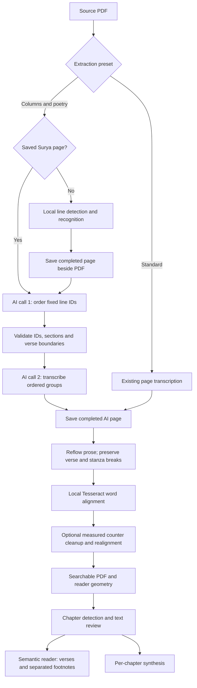

# Extraction prompt presets

In **Source files → Extract**, choose **AI model (cloud)**. Pick a prompt preset,
edit the instructions, and optionally name it with **Save preset** for reuse on
other books. Built-in presets cannot be deleted. Prompt edits are saved on the
book when extraction starts; closing the modal discards unsaved prompt edits.
Deleting a reusable preset does not change a book's selected instructions.

**Standard** uses the existing page-transcription path. It does not run Surya or
an ordering call. The default instructions keep printed wording, join split words,
and separate running headers/page numbers from body text.

**Columns and poetry** enables **Order detected lines before transcription**:

1. Surya detects and reads fixed lines locally, using already-installed weights.
2. The selected vision model orders groups of line IDs using your editable
   reading-order instructions. Code rejects missing/repeated/invented IDs and
   groups combining side-by-side columns, plus obvious row-by-row column alternation.
3. The model transcribes the whole page into one block per ordered group. Every
   group is retained as evidence, including page numbers and notes; model labels
   alone never decide what to omit. Numeric page furniture is excluded from
   narration only when local lines confirm it is isolated at the page edge. The response cannot drop or reorder whole groups.
4. Measured Tesseract words are assigned to their detected lines and aligned only
   within each group. The reader geometry and searchable PDF use those positions.

This mode needs the Marker/Surya model bundle. Each nonempty page makes two AI
calls: ordering, then transcription. A page with no detected lines instead makes
one blank-page check; visible text with no detected lines stops extraction.
Errors stop extraction for review; ordered calls do not retry automatically.
Standard retains its existing parse retries and low-coverage second look.

Surya checkpoints each completed page beside the source PDF in
`<source.pdf>.surya-lines.json`. The cache checks the PDF's SHA-256 and page count.
Cancellation keeps completed pages; an interrupted page runs again. Resuming
passes only missing page numbers to Surya, with one model process for the batch.
The temporary render/output directory can be removed without losing this cache.

AI reading starts as local pages become ready, with up to four pages in flight.
Completed AI pages retain their transcription and line groups for retries and
later local geometry refreshes. Changing instructions invalidates reuse of AI
pages read with different instructions, while retaining the local Surya cache.
Settings are captured when a job starts; edit while stopped and resume to apply
new instructions consistently. There is no prompt replacement inside a running job.
Older Standard checkpoints without a settings key remain reusable as Standard.

The log dock shows saved local and AI page counts. Detailed OCR progress bars are
hidden until **Show details** is selected; errors and page milestones remain visible.

The JSON contract and ID validation are fixed in code. The presets customize
reading/transcription policy, not those invariants. Changing the prompt cannot
make the model supply highlight coordinates.

The poetry experiment supports the constrained ordering approach; it does not
make line detection infallible. Overlapping or garbled Surya lines can still harm
results, and preserving groups is not proof that every word was transcribed
correctly. Inspect the result before synthesizing. No automatic page-complexity
selection is performed.

## Verse counters and the bounded sample run

Verse-line counters are a book-specific transcription instruction, not a global
number-removal regex. Song numbers, dates, ages and footnote references must remain.
The instruction should mention that OCR labels sometimes attach a margin counter
to its verse line, and that the words beside the counter must survive.

The 2026-09-17 run used 30 page attempts across ten distinct samples while fixing
the two-call contracts. The last five poetry samples all produced searchable PDFs
with 95–98% word placement. Four omitted the counters; source page 35 of
`147-281.pdf` still retained them. Prompt-only counter removal is therefore not a
guarantee. The local cleanup described below now removes the nine residual counters from this saved sample. The book remains suspended because the saved ordering also puts metadata before a verse continuation.
Placement and local-OCR overlap are diagnostics, not text-accuracy scores.

The local comparison viewer is at
`packages/server/data/review/extraction-2026-09-17/index.html`. It includes original
scans, transcripts, measured line overlays and searchable PDFs for five poetry
samples and four Standard controls. One difficult Bulgarian prose control remains
below the existing coverage threshold; it should also be reviewed before narration.

## Local verse-counter cleanup

**Remove margin verse counters after ordering** is an opt-in setting beneath the
reading-order instructions. It is off in both built-in presets. When enabled,
ordering uses the counters as clues and transcription is asked to retain them as
raw evidence. Cleanup runs locally before final word alignment and output writing.

A candidate must start a detected line with a positive multiple of five. It must
sit outside the indentation of at least two nearby narrow text lines. The exact
transcript token must align to a measured OCR token on that source line, whose box
ends to the left of the verse indentation. Only that token and its following
horizontal space are removed; verse words and paragraph breaks remain. Heading
numbers are excluded. This is a conservative layout heuristic for this kind of
book, not a general guarantee that every multiple of five is a counter. Ambiguous
or unaligned tokens remain for review. A missing local OCR pack stops enabled
cleanup rather than guessing positions.

`llm-pages.json` retains the raw transcription and line evidence. Each output
records removals, source line IDs, original text offsets and measured boxes in
`verse-counter-cleanup.json`. Word alignment runs again after removal, so the final
text, searchable PDF and reader offsets agree. Changing only this option reuses
paid pages; changing prompts still requires new AI reading. Turning cleanup off
restores the raw saved reading, including any counters the model retained.

Local replay on the five saved poetry pages removed nine counters from source page
35 and left the other four transcripts unchanged. The viewer's **Show local counter
cleanup** checkbox compares raw and cleaned text/PDFs. This operation does not
reorder existing passages or repair the metadata ordering visible on page 35.
The revised ordering instructions have not yet had another paid model test.

## Flowing text within extraction blocks

All extracted blocks pass through `extracted-text.ts`: Standard AI pages, ordered
AI outputs (including saved-page reprocessing), and Marker blocks. Models identify
prose, verse, headings, lists, footnotes and metadata. Prose wraps become spaces
and line-end word splits are rejoined. Verse retains line and stanza breaks.
Untyped legacy blocks retain the prose fallback. HTML line breaks become newlines
before kind-aware formatting, preventing adjacent words from running together.

AI output normalization runs before word alignment, so transcript offsets,
searchable text and highlight positions agree. The raw ordered transcription
remains saved for inspection. This is shared extraction behavior, independent of
the book-specific verse-counter option. Existing chapter text is not silently
rewritten. Standard now receives shared semantic classification instructions;
its extraction path, retry policy and default base prompt remain unchanged.

## Fresh semantic evaluation

The user approved fewer than ten additional page attempts. Seven completed:
five ordered poetry pages and English/Bulgarian Standard prose controls. Both
previously failing pages now put right-column verse before collection metadata.
The Bulgarian prose control identifies footnotes 14 and 15 separately. Local
cleanup removed 38 measured counters across the five poetry pages. All seven
produced searchable PDFs; placement ranged from 95% to 100%, not a text-accuracy
score. Cached local lines were reused; these timings exclude initial Surya work.

Actual automatic results, without manual content or order correction:
`packages/server/data/review/extraction-2026-09-17/automatic-structure.html`.
The older `structure-preview.html` remains the manually corrected reference.

The final review added explicit line-versus-stanza boundaries to ordered groups.
Two further authorized pages (nine attempts total in this batch) confirmed all
seven verse-column continuations. Printed page numbers 181 and 92 remain in the
raw evidence and searchable PDF but are excluded from chapter/narration text after
numeric, margin and isolation checks. Metadata, prose and footnote blocks are
protected from verse-counter cleanup.

Chapter assembly, TTS normalization and page-offset mapping share the same block
join and spans. Reader documents preserve semantic ranges; the full reader and
chapter modal render footnote rules and verse lines without adding spoken separator
characters. Edited/stale text falls back to plain text rather than applying wrong
structure. Legacy documents and Standard extraction keep their existing paths.

Nine attempts are a bounded sample, not proof of perfect transcription. Wording
errors and occasional imperfect model classification remain. Production stays
suspended. A small trial uses isolated PDF pages and the corresponding cached
Surya lines, runs the normal extraction code, and writes only review artifacts.
It never queues the full source file or replaces existing chapters/audio.

Final local verification: 886 tests, lint, typecheck and the production build pass.
No full E2E suite or full-book DeepSeek run was started.
